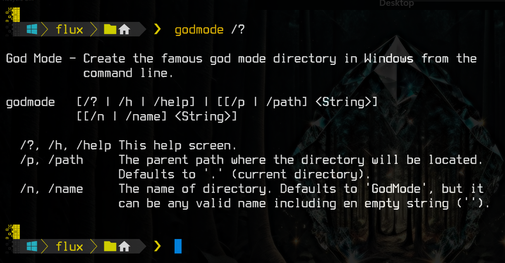
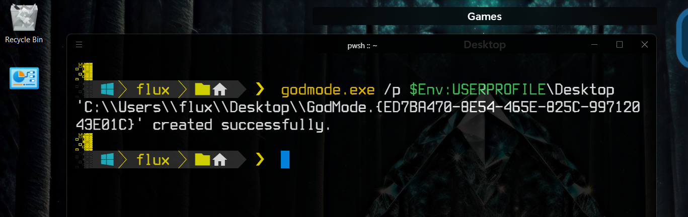
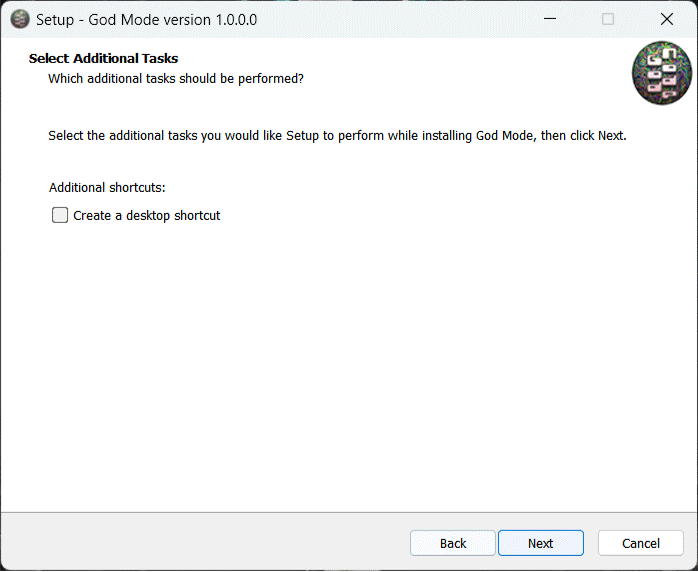

# God Mode 


<!-- ***This project is*** ![Under Construction](https://img.shields.io/static/v1?logo=data:image/png;base64,iVBORw0KGgoAAAANSUhEUgAAAA4AAAAOCAYAAAAfSC3RAAACmElEQVQokUWSa0iTcRTGn//26u4b6ZQ0U8lKMqykwPpgZVBEHyLp8jEoIZJADCQ0iCiStIwuZmHRioIuroQss2VkrkIrdeFckiZqdhctTXPOve8Tr7M6X8/zO+fwPEfIwy7IwQA0GgExGYQwyhCmMLRX1z2hJCJSN+xZgqAZnPgCaAUQ0EHICjSYLlKBCDdNQb7HLmeRoy3zQFnzYk/1WTckGUIXCVD+Kw+BpAxtuBXCpkN7bdXt/JL3W3J3xuHg3iTsL/NkNFWVPoWkQOj/wxooCrRhFgiTjI4n9ZVHHQObjxVEY8UGIi1zEhVFCahwdq5qvn+hHkKC0EcBigxwvAnkW3ge7L6TMi+VztOLOOKOY8ulKL68GM2emnjeLF3AZSlz2FCZ6yaHwLGv6pkv8MyxsUoHLcsLwBuHwE0rtdy2UuLWNTpmpkkszQEfnAPDAd47tbaB7NaJR+eXujfmtGTUXgFWp5uwPd8Oi1GBJEmwWYlP34L4PSFw7chPeD+MYnkWUVmy0CeNfe5N8ANIjNWpNmHzqklYrDIGRwRm2gXsM/xofRMOf1AgcbYOAfgxMvgxCmS9+dbh5A6VarxuIMdBDoJ0g+vSreytNpAEux7qqWrK82I+kC2xYOAzyFbz5QNJPrXhdRo4XK/n3WILkxPsbKqwsr8xBB3PjukhGyJJv+qqB+QvkN0mR2Fim5pU1hobzxTYOPbcyJoTNpoAlu6wdZKvIslR0O9VXe0Clc5p2Ge4WDh36ux3ThM/1RqnNhXvilU32cjvINtAf4cKdkzlSHpBTqgNY11JfLtFA+o14NU8Wx/piggNfg2yGVR8EF9/dP37PyCIoDQLs8z9hmv71nsC4wFz9klX2tD4/AEG+gBoQ7KghD8MZ2xdnt7s7wAAAABJRU5ErkJggg==&label=Under&message=Construction&style=for-the-badge&labelColor=1D1D1D&color=ffff99) -->

---

- [God Mode ](#god-mode-)
  - [About](#about)
    - [Description](#description)
    - [Motivation](#motivation)
  - [Support Me If You Like](#support-me-if-you-like)
  - [Usage](#usage)
    - [Environment](#environment)
    - [How](#how)
      - [Portable](#portable)
      - [Installation](#installation)
    - [Examples](#examples)
      - [Help](#help)
      - [Create the GodMode directory on the desktop in PowerShell](#create-the-godmode-directory-on-the-desktop-in-powershell)
      - [Create the GodMode directory on the desktop in CMD](#create-the-godmode-directory-on-the-desktop-in-cmd)
      - [Create the GodMode directory with no name](#create-the-godmode-directory-with-no-name)
  - [Project Information](#project-information)
    - [Source File Quality](#source-file-quality)
    - [File MD5 Hashes](#file-md5-hashes)
    - [Current Windows X86 MD5](#current-windows-x86-md5)
    - [Current Windows X64 MD5](#current-windows-x64-md5)
    - [Current Windows X86 Installer MD5](#current-windows-x86-installer-md5)
    - [Current Windows X64 Installer MD5](#current-windows-x64-installer-md5)
    - [Other Miscellaneous File Information](#other-miscellaneous-file-information)
  - [Notes](#notes)
    - [Note 1](#note-1)
  - [Media](#media)
    - [Logo](#logo)
    - [Help Screen](#help-screen)
    - [Examples In PowerShell And CMD](#examples-in-powershell-and-cmd)
    - [Installer Preview](#installer-preview)
  - [LICENSE](#license)


---

## About

&#x41;&#x6c;&#x6c;&#x20;&#x66;&#x69;&#x6c;&#x65;&#x73;&#x20;&#x63;&#x61;&#x6e;&#x20;&#x62;&#x65;&#x20;&#x66;&#x6f;&#x75;&#x6e;&#x64;&#x20;&#x6f;&#x6e;&#x20;&#x74;&#x68;&#x65;&#x20;[Releases](https://github.com/Lateralus138/godmode/releases)&#x20;&#x70;&#x61;&#x67;&#x65;&#x2e; 

### Description

&#x27;&#x47;&#x6f;&#x64;&#x20;&#x4d;&#x6f;&#x64;&#x65;&#x27;&#x20;&#x69;&#x73;&#x20;&#x61;&#x20;*Windows*&#x20;&#x6f;&#x6e;&#x6c;&#x79;&#x20;&#x63;&#x6f;&#x6d;&#x6d;&#x61;&#x6e;&#x64;&#x20;&#x6c;&#x69;&#x6e;&#x65;&#x20;&#x75;&#x74;&#x69;&#x6c;&#x74;&#x79;&#x20;&#x74;&#x6f;&#x20;&#x68;&#x65;&#x6c;&#x70;&#x20;&#x63;&#x72;&#x65;&#x61;&#x74;&#x65;&#x20;&#x74;&#x68;&#x65;&#x20;&#x61;&#x20;&#x64;&#x69;&#x72;&#x65;&#x63;&#x74;&#x6f;&#x72;&#x79;&#x20;&#x77;&#x69;&#x74;&#x68;&#x20;&#x6d;&#x61;&#x6e;&#x79;&#x20;&#x73;&#x68;&#x6f;&#x72;&#x74;&#x63;&#x75;&#x74;&#x73;&#x20;&#x74;&#x6f;&#x20;&#x76;&#x61;&#x72;&#x69;&#x6f;&#x75;&#x73;&#x20;&#x61;&#x64;&#x6d;&#x69;&#x6e;&#x69;&#x73;&#x74;&#x72;&#x61;&#x74;&#x69;&#x76;&#x65;&#x20;&#x74;&#x6f;&#x6f;&#x6c;&#x73;&#x2e;&#x20;&#x59;&#x6f;&#x75;&#x20;&#x63;&#x61;&#x6e;&#x20;&#x6e;&#x6f;&#x72;&#x6d;&#x61;&#x6c;&#x6c;&#x79;&#x20;&#x63;&#x72;&#x65;&#x61;&#x74;&#x65;&#x20;&#x74;&#x68;&#x69;&#x73;&#x20;&#x62;&#x79;&#x20;&#x63;&#x72;&#x65;&#x61;&#x74;&#x69;&#x6e;&#x67;&#x20;&#x61;&#x20;&#x66;&#x6f;&#x6c;&#x64;&#x65;&#x72;&#x20;&#x61;&#x6e;&#x64;&#x20;&#x6e;&#x61;&#x6d;&#x69;&#x6e;&#x67;&#x20;&#x69;&#x74;&#x20;`.{ED7BA470-8E54-465E-825C-99712043E01C}`<sup>[[1](#note-1)]</sup>&#x20;&#x6f;&#x72;&#x20;`whatever_name_you_like.{ED7BA470-8E54-465E-825C-99712043E01C}`&#x2e;&#x20;&#x54;&#x68;&#x69;&#x73;&#x20;&#x75;&#x74;&#x69;&#x6c;&#x69;&#x74;&#x79;&#x20;&#x6a;&#x75;&#x73;&#x74;&#x20;&#x6d;&#x61;&#x6b;&#x65;&#x73;&#x20;&#x69;&#x74;&#x20;&#x65;&#x61;&#x73;&#x69;&#x65;&#x72;&#x20;&#x74;&#x6f;&#x20;&#x64;&#x6f;&#x20;&#x70;&#x72;&#x6f;&#x67;&#x72;&#x61;&#x6d;&#x6d;&#x61;&#x74;&#x69;&#x63;&#x61;&#x6c;&#x6c;&#x79;&#x2e;

**All executable binaries (portable and installation) provided by this repository were built at this repository**&#x20;&#x61;&#x6e;&#x64;&#x20;&#x4d;&#x44;&#x35;&#x20;&#x68;&#x61;&#x73;&#x68;&#x65;&#x73;&#x20;&#x77;&#x65;&#x72;&#x65;&#x20;&#x6f;&#x62;&#x74;&#x61;&#x69;&#x6e;&#x65;&#x64;&#x20;&#x64;&#x75;&#x72;&#x69;&#x6e;&#x67;&#x20;&#x63;&#x6f;&#x6d;&#x70;&#x69;&#x6c;&#x65;&#x2f;&#x62;&#x75;&#x69;&#x6c;&#x64;&#x20;&#x74;&#x69;&#x6d;&#x65;&#x20;&#x61;&#x6e;&#x64;&#x20;&#x61;&#x72;&#x65;&#x20;&#x75;&#x70;&#x64;&#x61;&#x74;&#x65;&#x64;&#x20;&#x61;&#x74;&#x20;&#x74;&#x68;&#x65;&#x20;&#x73;&#x61;&#x6d;&#x65;&#x20;&#x74;&#x69;&#x6d;&#x65;&#x20;&#x61;&#x6e;&#x64;&#x20;&#x70;&#x72;&#x6f;&#x76;&#x69;&#x64;&#x65;&#x64;&#x20;&#x62;&#x65;&#x6c;&#x6f;&#x77;&#x20;&#x61;&#x6e;&#x64;&#x20;&#x6f;&#x6e;&#x20;&#x74;&#x68;&#x65;&#x20;&#x52;&#x65;&#x6c;&#x65;&#x61;&#x73;&#x65;&#x20;&#x70;&#x61;&#x67;&#x65;&#x2e;

### Motivation

&#x49;&#x20;&#x63;&#x72;&#x65;&#x61;&#x74;&#x65;&#x20;&#x74;&#x68;&#x69;&#x73;&#x20;&#x64;&#x69;&#x72;&#x65;&#x63;&#x74;&#x6f;&#x72;&#x79;&#x20;&#x66;&#x6f;&#x72;&#x20;&#x76;&#x61;&#x72;&#x69;&#x6f;&#x75;&#x73;&#x20;&#x72;&#x65;&#x61;&#x73;&#x6f;&#x6e;&#x73;&#x20;&#x6f;&#x66;&#x74;&#x65;&#x6e;&#x20;&#x61;&#x6e;&#x64;&#x20;&#x49;&#x20;&#x6c;&#x69;&#x6b;&#x65;&#x20;&#x74;&#x6f;&#x20;&#x68;&#x61;&#x76;&#x65;&#x20;&#x75;&#x74;&#x69;&#x6c;&#x69;&#x74;&#x69;&#x65;&#x73;&#x20;&#x66;&#x6f;&#x72;&#x20;&#x65;&#x76;&#x65;&#x72;&#x79;&#x74;&#x68;&#x69;&#x6e;&#x67;&#x20;&#x49;&#x20;&#x64;&#x6f;&#x2e;&#x20;&#x54;&#x68;&#x69;&#x73;&#x20;&#x69;&#x73;&#x20;&#x61;&#x64;&#x64;&#x65;&#x64;&#x20;&#x74;&#x6f;&#x20;&#x6d;&#x79;&#x20;&#x6d;&#x61;&#x69;&#x6e;&#x20;&#x57;&#x69;&#x6e;&#x64;&#x6f;&#x77;&#x73;&#x20;&#x55;&#x74;&#x69;&#x6c;&#x73;&#x20;&#x70;&#x61;&#x63;&#x6b;&#x61;&#x67;&#x65;&#x20;&#x6f;&#x6e;&#x20;&#x61;&#x20;&#x55;&#x53;&#x42;&#x20;&#x65;&#x73;&#x70;&#x65;&#x63;&#x69;&#x61;&#x6c;&#x6c;&#x79;&#x20;&#x66;&#x6f;&#x72;&#x20;&#x77;&#x6f;&#x72;&#x6b;&#x69;&#x6e;&#x67;&#x20;&#x6f;&#x6e;&#x20;&#x6d;&#x75;&#x6c;&#x74;&#x69;&#x70;&#x6c;&#x65;&#x20;&#x63;&#x6f;&#x6d;&#x70;&#x75;&#x74;&#x65;&#x72;&#x73;&#x2e;

---

## Support Me If You Like

&#x49;&#x66;&#x20;&#x79;&#x6f;&#x75;&#x20;&#x6c;&#x69;&#x6b;&#x65;&#x20;&#x61;&#x6e;&#x79;&#x20;&#x6f;&#x66;&#x20;&#x74;&#x68;&#x65;&#x20;&#x70;&#x72;&#x6f;&#x6a;&#x65;&#x63;&#x74;&#x73;&#x20;&#x62;&#x65;&#x6c;&#x6f;&#x77;&#x20;&#x61;&#x6e;&#x64;&#x20;&#x63;&#x61;&#x72;&#x65;&#x20;&#x74;&#x6f;&#x20;&#x64;&#x6f;&#x6e;&#x61;&#x74;&#x65;&#x20;&#x74;&#x6f;&#x20;&#x6d;&#x79;&#x20;***PayPal***&#x3a;

[](https://paypal.me/ianapride?locale.x=en_US)

&#x4f;&#x72;&#x20;***Buy Me A Coffee***&#x20;&#x69;&#x66;&#x20;&#x79;&#x6f;&#x75;&#x72;&#x20;&#x70;&#x72;&#x65;&#x66;&#x65;&#x72;&#x3a;

[](https://www.buymeacoffee.com/ianalanpride)

---

## Usage

### Environment

&#x54;&#x68;&#x69;&#x73;&#x20;&#x69;&#x73;&#x20;&#x61;&#x20;**Windows**&#x20;&#x63;&#x6f;&#x6d;&#x6d;&#x61;&#x6e;&#x64;&#x20;&#x6c;&#x69;&#x6e;&#x65;&#x20;&#x74;&#x6f;&#x6f;&#x6c;&#x20;&#x66;&#x6f;&#x72;&#x20;**CMD**&#x20;&#x61;&#x6e;&#x64;&#x20;**PowerShell**&#x2e;&#x20;&#x54;&#x68;&#x69;&#x73;&#x20;&#x74;&#x6f;&#x6f;&#x6c;&#x20;&#x69;&#x73;&#x20;&#x61;&#x20;&#x73;&#x69;&#x6e;&#x67;&#x6c;&#x65;&#x20;&#x73;&#x74;&#x61;&#x6e;&#x64;&#x2d;&#x61;&#x6c;&#x6f;&#x6e;&#x65;&#x20;&#x65;&#x78;&#x65;&#x63;&#x75;&#x74;&#x61;&#x62;&#x6c;&#x65;&#x20;&#x61;&#x6e;&#x64;&#x20;&#x74;&#x68;&#x65;&#x72;&#x65;&#x66;&#x6f;&#x72;&#x65;&#x20;&#x63;&#x61;&#x6e;&#x20;&#x62;&#x65;&#x20;&#x75;&#x73;&#x65;&#x64;&#x20;&#x70;&#x6f;&#x72;&#x74;&#x61;&#x62;&#x6c;&#x79;&#x2c;&#x20;&#x62;&#x75;&#x74;&#x20;&#x68;&#x61;&#x73;&#x20;&#x61;&#x6e;&#x20;&#x69;&#x6e;&#x73;&#x74;&#x61;&#x6c;&#x6c;&#x65;&#x72;&#x20;&#x70;&#x72;&#x6f;&#x76;&#x69;&#x64;&#x65;&#x64;&#x2e;&#x20;&#x54;&#x68;&#x65;&#x20;&#x69;&#x6e;&#x73;&#x74;&#x61;&#x6c;&#x6c;&#x65;&#x72;&#x20;&#x70;&#x72;&#x6f;&#x76;&#x69;&#x64;&#x65;&#x73;&#x20;&#x61;&#x20;&#x6d;&#x65;&#x61;&#x6e;&#x73;&#x20;&#x66;&#x6f;&#x72;&#x20;&#x65;&#x61;&#x73;&#x79;&#x20;&#x72;&#x65;&#x6d;&#x6f;&#x76;&#x61;&#x6c;&#x20;&#x61;&#x6e;&#x64;&#x20;&#x74;&#x68;&#x65;&#x20;&#x6f;&#x70;&#x74;&#x69;&#x6f;&#x6e;&#x20;&#x74;&#x6f;&#x20;&#x61;&#x64;&#x64;&#x20;&#x74;&#x68;&#x65;&#x20;&#x70;&#x72;&#x6f;&#x67;&#x72;&#x61;&#x6d;&#x73;&#x20;*path*&#x20;&#x74;&#x6f;&#x20;&#x74;&#x68;&#x65;&#x20;`%PATH%`&#x20;&#x65;&#x6e;&#x76;&#x69;&#x72;&#x6f;&#x6e;&#x6d;&#x65;&#x6e;&#x74;&#x20;&#x76;&#x61;&#x72;&#x69;&#x61;&#x62;&#x6c;&#x65;&#x20;&#x28;&#x77;&#x68;&#x69;&#x63;&#x68;&#x20;&#x69;&#x73;&#x20;&#x61;&#x6c;&#x73;&#x6f;&#x20;&#x72;&#x65;&#x6d;&#x6f;&#x76;&#x65;&#x64;&#x20;&#x6f;&#x6e;&#x20;&#x75;&#x6e;&#x69;&#x6e;&#x73;&#x74;&#x61;&#x6c;&#x6c;&#x61;&#x74;&#x69;&#x6f;&#x6e;&#x29;&#x2e;&#x20;&#x54;&#x68;&#x65;&#x72;&#x65;&#x20;&#x61;&#x72;&#x65;&#x20;&#x62;&#x6f;&#x74;&#x68;&#x20;&#x78;&#x38;&#x36;&#x20;&#x28;&#x33;&#x32;&#x20;&#x62;&#x69;&#x74;&#x29;&#x20;&#x61;&#x6e;&#x64;&#x20;&#x78;&#x36;&#x34;&#x20;&#x28;&#x36;&#x34;&#x20;&#x62;&#x69;&#x74;&#x29;&#x20;&#x76;&#x65;&#x72;&#x73;&#x69;&#x6f;&#x6e;&#x73;&#x20;&#x6f;&#x66;&#x20;&#x62;&#x6f;&#x74;&#x68;&#x20;&#x74;&#x68;&#x65;&#x20;&#x70;&#x6f;&#x72;&#x74;&#x61;&#x62;&#x6c;&#x65;&#x20;&#x61;&#x6e;&#x64;&#x20;&#x69;&#x6e;&#x73;&#x74;&#x61;&#x6c;&#x6c;&#x65;&#x72;&#x20;&#x65;&#x78;&#x65;&#x63;&#x75;&#x74;&#x61;&#x62;&#x6c;&#x65;&#x73;&#x2e; 

### How

#### Portable

&#x41;&#x73;&#x20;&#x77;&#x69;&#x74;&#x68;&#x20;&#x61;&#x6e;&#x79;&#x20;&#x70;&#x6f;&#x72;&#x74;&#x61;&#x62;&#x6c;&#x65;&#x20;&#x70;&#x72;&#x6f;&#x67;&#x72;&#x61;&#x6d;&#x20;&#x74;&#x68;&#x69;&#x73;&#x20;&#x63;&#x61;&#x6e;&#x20;&#x62;&#x65;&#x20;&#x70;&#x6c;&#x61;&#x63;&#x65;&#x64;&#x20;&#x61;&#x6e;&#x79;&#x77;&#x68;&#x65;&#x72;&#x65;&#x20;&#x79;&#x6f;&#x75;&#x20;&#x6c;&#x69;&#x6b;&#x65;&#x20;&#x6f;&#x6e;&#x20;&#x79;&#x6f;&#x75;&#x72;&#x20;&#x6d;&#x61;&#x63;&#x68;&#x69;&#x6e;&#x65;&#x2c;&#x20;&#x62;&#x75;&#x74;&#x20;&#x6d;&#x6f;&#x72;&#x65;&#x20;&#x70;&#x72;&#x65;&#x66;&#x65;&#x72;&#x61;&#x62;&#x6c;&#x79;&#x20;&#x69;&#x6e;&#x20;&#x61;&#x20;&#x64;&#x69;&#x72;&#x65;&#x63;&#x74;&#x6f;&#x72;&#x79;&#x20;&#x74;&#x68;&#x61;&#x74;&#x20;&#x69;&#x73;&#x20;&#x69;&#x6e;&#x20;&#x79;&#x6f;&#x75;&#x72;&#x20;`%PATH%`&#x20;&#x65;&#x6e;&#x76;&#x69;&#x72;&#x6f;&#x6e;&#x6d;&#x65;&#x6e;&#x74;&#x20;&#x76;&#x61;&#x72;&#x69;&#x61;&#x62;&#x6c;&#x65;&#x20;&#x73;&#x6f;&#x20;&#x79;&#x6f;&#x75;&#x20;&#x63;&#x61;&#x6e;&#x20;&#x72;&#x75;&#x6e;&#x20;&#x69;&#x74;&#x20;&#x77;&#x69;&#x74;&#x68;&#x6f;&#x75;&#x74;&#x20;&#x61;&#x20;&#x66;&#x75;&#x6c;&#x6c;&#x20;&#x70;&#x61;&#x74;&#x68;&#x20;&#x28;`godmode`&#x20;&#x66;&#x6f;&#x72;&#x20;&#x65;&#x78;&#x61;&#x6d;&#x70;&#x6c;&#x65;&#x29;&#x2e;&#x20;&#x49;&#x20;&#x72;&#x65;&#x63;&#x6f;&#x6d;&#x6d;&#x65;&#x6e;&#x64;&#x20;&#x75;&#x73;&#x69;&#x6e;&#x67;&#x20;&#x61;&#x20;&#x64;&#x65;&#x64;&#x69;&#x63;&#x61;&#x74;&#x65;&#x64;&#x20;*Bin*&#x20;&#x64;&#x69;&#x72;&#x65;&#x63;&#x74;&#x6f;&#x72;&#x79;&#x2c;&#x20;&#x62;&#x75;&#x74;&#x20;&#x6f;&#x66;&#x20;&#x63;&#x6f;&#x75;&#x72;&#x73;&#x65;&#x2c;&#x20;&#x69;&#x74;&#x27;&#x73;&#x20;&#x79;&#x6f;&#x75;&#x72;&#x20;&#x63;&#x68;&#x6f;&#x69;&#x63;&#x65;&#x2e;&#x20;&#x49;&#x66;&#x20;&#x79;&#x6f;&#x75;&#x72;&#x20;&#x70;&#x61;&#x74;&#x68;&#x20;&#x69;&#x73;&#x6e;&#x27;&#x74;&#x20;&#x61;&#x6c;&#x72;&#x65;&#x61;&#x64;&#x79;&#x20;&#x69;&#x6e;&#x20;&#x79;&#x6f;&#x75;&#x72;&#x20;`%PATH%`&#x20;&#x65;&#x6e;&#x76;&#x69;&#x72;&#x6f;&#x6e;&#x6d;&#x65;&#x6e;&#x74;&#x20;&#x74;&#x68;&#x65;&#x6e;&#x20;&#x49;&#x20;&#x73;&#x75;&#x67;&#x67;&#x65;&#x73;&#x74;&#x20;&#x61;&#x64;&#x64;&#x69;&#x6e;&#x67;&#x20;&#x69;&#x74;<sup>[[3](#note-3)]</sup>&#x2c;&#x20;&#x62;&#x75;&#x74;&#x20;&#x69;&#x66;&#x20;&#x6e;&#x6f;&#x74;&#x20;&#x74;&#x68;&#x65;&#x6e;&#x20;&#x79;&#x6f;&#x75;&#x20;&#x68;&#x61;&#x76;&#x65;&#x20;&#x70;&#x72;&#x6f;&#x76;&#x69;&#x64;&#x65;&#x20;&#x74;&#x68;&#x65;&#x20;&#x66;&#x75;&#x6c;&#x6c;&#x20;&#x70;&#x61;&#x74;&#x68;&#x20;&#x28;`C:\Path\To\godmode.exe`&#x20;&#x66;&#x6f;&#x72;&#x20;&#x65;&#x78;&#x61;&#x6d;&#x70;&#x6c;&#x65;&#x29;&#x20;&#x77;&#x68;&#x65;&#x6e;&#x20;&#x65;&#x78;&#x65;&#x63;&#x75;&#x74;&#x69;&#x6e;&#x67;&#x20;&#x74;&#x68;&#x65;&#x20;&#x70;&#x72;&#x6f;&#x67;&#x72;&#x61;&#x6d;&#x2e;

#### Installation

&#x54;&#x68;&#x6f;&#x75;&#x67;&#x68;&#x20;&#x69;&#x74;&#x27;&#x73;&#x20;&#x6e;&#x6f;&#x74;&#x20;&#x6e;&#x65;&#x63;&#x65;&#x73;&#x73;&#x61;&#x72;&#x79;&#x20;&#x61;&#x6e;&#x20;&#x69;&#x6e;&#x73;&#x74;&#x61;&#x6c;&#x6c;&#x65;&#x72;&#x20;&#x69;&#x73;&#x20;&#x70;&#x72;&#x6f;&#x76;&#x69;&#x64;&#x65;&#x64;&#x20;&#x66;&#x6f;&#x72;&#x20;&#x62;&#x6f;&#x74;&#x68;&#x20;&#x74;&#x68;&#x65;&#x20;&#x33;&#x32;&#x20;&#x62;&#x69;&#x74;&#x20;&#x61;&#x6e;&#x64;&#x20;&#x36;&#x34;&#x20;&#x62;&#x69;&#x74;&#x20;&#x76;&#x65;&#x72;&#x73;&#x69;&#x6f;&#x6e;&#x73;&#x2e;&#x20;&#x54;&#x68;&#x65;&#x20;&#x69;&#x6e;&#x73;&#x74;&#x61;&#x6c;&#x6c;&#x65;&#x72;&#x20;&#x70;&#x72;&#x6f;&#x76;&#x69;&#x64;&#x65;&#x73;&#x20;&#x61;&#x20;&#x77;&#x61;&#x79;&#x20;&#x74;&#x6f;&#x20;&#x65;&#x61;&#x73;&#x69;&#x6c;&#x79;&#x20;&#x75;&#x6e;&#x69;&#x6e;&#x73;&#x74;&#x61;&#x6c;&#x6c;&#x20;&#x74;&#x68;&#x65;&#x20;&#x70;&#x72;&#x6f;&#x67;&#x72;&#x61;&#x6d;&#x20;&#x6c;&#x69;&#x6b;&#x65;&#x20;&#x79;&#x6f;&#x75;&#x20;&#x77;&#x6f;&#x75;&#x6c;&#x64;&#x20;&#x61;&#x6e;&#x79;&#x20;&#x6f;&#x74;&#x68;&#x65;&#x72;&#x20;&#x57;&#x69;&#x6e;&#x64;&#x6f;&#x77;&#x73;&#x20;&#x70;&#x72;&#x6f;&#x67;&#x72;&#x61;&#x6d;&#x20;&#x61;&#x6e;&#x64;&#x20;&#x61;&#x6c;&#x73;&#x6f;&#x20;&#x70;&#x72;&#x6f;&#x76;&#x69;&#x64;&#x65;&#x73;&#x20;&#x74;&#x68;&#x65;&#x20;&#x61;&#x62;&#x69;&#x6c;&#x69;&#x74;&#x79;&#x20;&#x74;&#x6f;&#x20;&#x61;&#x75;&#x74;&#x6f;&#x6d;&#x61;&#x74;&#x69;&#x63;&#x61;&#x6c;&#x6c;&#x79;&#x20;&#x61;&#x64;&#x64;&#x20;&#x74;&#x68;&#x65;&#x20;&#x70;&#x72;&#x6f;&#x67;&#x72;&#x61;&#x6d;&#x27;&#x73;&#x20;&#x64;&#x69;&#x72;&#x65;&#x63;&#x74;&#x6f;&#x72;&#x79;&#x20;&#x74;&#x6f;&#x20;&#x74;&#x68;&#x65;&#x20;&#x25;&#x50;&#x41;&#x54;&#x48;&#x25;&#x20;&#x65;&#x6e;&#x76;&#x69;&#x72;&#x6f;&#x6e;&#x6d;&#x65;&#x6e;&#x74;&#x20;&#x76;&#x61;&#x72;&#x69;&#x61;&#x62;&#x6c;&#x65;&#x2e;&#x20;&#x45;&#x76;&#x65;&#x72;&#x79;&#x74;&#x68;&#x69;&#x6e;&#x67;&#x20;&#x69;&#x73;&#x20;&#x72;&#x65;&#x6d;&#x6f;&#x76;&#x65;&#x64;&#x20;&#x75;&#x70;&#x6f;&#x6e;&#x20;&#x75;&#x6e;&#x69;&#x6e;&#x73;&#x74;&#x61;&#x6c;&#x6c;&#x61;&#x74;&#x69;&#x6f;&#x6e;&#x2e;&#x20;&#x4a;&#x75;&#x73;&#x74;&#x20;&#x64;&#x6f;&#x77;&#x6e;&#x6c;&#x6f;&#x61;&#x64;&#x20;&#x74;&#x68;&#x65;&#x20;&#x69;&#x6e;&#x73;&#x74;&#x61;&#x6c;&#x6c;&#x65;&#x72;&#x20;&#x6f;&#x66;&#x20;&#x79;&#x6f;&#x75;&#x72;&#x20;&#x63;&#x68;&#x6f;&#x69;&#x63;&#x65;&#x20;&#x61;&#x6e;&#x64;&#x20;&#x72;&#x75;&#x6e;&#x20;&#x6c;&#x69;&#x6b;&#x65;&#x20;&#x79;&#x6f;&#x75;&#x20;&#x77;&#x6f;&#x75;&#x6c;&#x64;&#x20;&#x61;&#x6e;&#x79;&#x20;&#x6f;&#x74;&#x68;&#x65;&#x72;&#x20;&#x69;&#x6e;&#x74;&#x61;&#x6c;&#x6c;&#x65;&#x72;&#x20;&#x69;&#x6e;&#x20;&#x57;&#x69;&#x6e;&#x64;&#x6f;&#x77;&#x73;&#x2e;

&#x41;&#x20;&#x70;&#x72;&#x65;&#x76;&#x69;&#x65;&#x77;&#x20;&#x69;&#x73;&#x20;&#x70;&#x72;&#x6f;&#x76;&#x69;&#x64;&#x65;&#x64;&#x20;[below](#installer-preview).

### Examples

#### Help

```
PS> & godmode /?

God Mode - Create the famous god mode directory in Windows from the
           command line.

godmode   [/? | /h | /help] | [[/p | /path] <String>]
          [[/n | /name] <String>]

  /?, /h, /help This help screen.
  /p, /path     The parent path where the directory will be located.
                Defaults to '.' (current directory).
  /n, /name     The name of directory. Defaults to 'GodMode', but it
                can be any valid name including en empty string ('').

PS> 
```

#### Create the GodMode directory on the desktop in PowerShell

```
PS> & godmode.exe /p $Env:USERPROFILE\Desktop
'C:\\Users\\<USERNAME>\\Desktop\\GodMode.{ED7BA470-8E54-465E-825C-99712043E01C}' created successfully.

PS> 
```

#### Create the GodMode directory on the desktop in CMD

```
C:\Users\<USERNAME>> godmode.exe /p %userprofile%\Desktop
'C:\\Users\\<USERNAME>\\Desktop\\GodMode.{ED7BA470-8E54-465E-825C-99712043E01C}' created successfully.

PS> 
```

#### Create the GodMode directory with no name

```
PS> godmode.exe /n ''
'C:\\Users\\<USERNAME>\\.{ED7BA470-8E54-465E-825C-99712043E01C}' created successfully.

```

---

## Project Information

&#x54;&#x68;&#x69;&#x73;&#x20;&#x70;&#x72;&#x6f;&#x6a;&#x65;&#x63;&#x74;&#x20;&#x69;&#x73;&#x20;&#x77;&#x72;&#x69;&#x74;&#x74;&#x65;&#x6e;&#x20;&#x69;&#x6e;&#x20;`C++`.

[![C++](https://img.shields.io/endpoint?url=https://raw.githubusercontent.com/Lateralus138/godmode/master/docs/json/cpp.json&logo=data%3Aimage%2Fpng%3Bbase64%2CiVBORw0KGgoAAAANSUhEUgAAABAAAAAQCAMAAAAoLQ9TAAAABGdBTUEAALGPC%2FxhBQAAACBjSFJNAAB6JgAAgIQAAPoAAACA6AAAdTAAAOpgAAA6mAAAF3CculE8AAABcVBMVEUAAAAAgM0Af8wolNQAa7YAbbkAQIcAQIYAVJ0AgM0AgM0AgM0AgM0AgM0AgM0AgM0AgM0AgM0AgM0Af8wAfswAfswAf8wAgM0AgM0AgM0Af80AgM0AgM0AgM0AgM0Af8wAgM0Af80djtIIg84Af8wAfsxYrN4Fg84Gg85RqNwej9MLhM8LhM8AfcsAgM0Hg88AfsshkNNTqd1%2Fv%2BUXi9AHdsAAYKoAY64ih8kAf81YkcEFV54GV55Sj8EnlNULhc8AecYdebwKcrsAe8gAb7oAXacAXqgAcLwAImUAUpoAVJ0AUpwAUZoAIWMAVJ0AVJ0AUpwAUZwAVJ0AVJ0AVJ0AVJ0AgM0cjtJqteGczetqtOEAf807ndjL5fT9%2Fv7%2F%2F%2F%2FM5fQ9ntnu9vu12vCi0Oz%2F%2F%2F6Hw%2Bebzeufz%2Bx%2Bv%2BW12e%2Bgz%2BxqteLu9fmRx%2BjL3Ovu8%2Fi1zeKrzeUAUpw7e7M8fLQAU50cZ6hqm8WcvNgAVJ3xWY3ZAAAAVnRSTlMAAAAAAAAAAAAREApTvrxRCQQ9rfX0qwErleyUKjncOFv%2B%2Fv5b%2Ff7%2B%2Fv7%2B%2Fv1b%2Ff7%2B%2Fv7%2BW%2F7%2B%2Fv79%2Fv7%2B%2Fv7%2B%2Fv7%2B%2Fjfa2jcBKJHqKAEEO6r0CVC8EFaOox4AAAABYktHRF9z0VEtAAAACXBIWXMAAA7DAAAOwwHHb6hkAAAAB3RJTUUH5QYKDQws%2FBWF6QAAAONJREFUGNNjYAABRkZOLkZGBhhgZOTm4eXjF4AJMQoKCYuEhYmKCQmCRBjFJSSlwiMiI6PCpaRlxBkZGGXlomNi4%2BLj4xISo%2BXkgQIKikqx8UnJyUnxKcqKKiAB1ajUJDV1Dc00LW0dXSaggF56fLK%2BgYFhhlGmsQkzRCDL1MzcIhsmYJkTn2tlbWObZ2cP0sKk4OCYH19QWFgQX%2BTkrMLEwOLiWlySD7I2v7TMzZ2Vgc3D08u7vKKysqLc28vHlx3oVg4%2F%2F4DAqqrAAH8%2FDohnODiCgkNCgoM4OOD%2B5eAIDYVyAZ9mMF8DmkLwAAAAJXRFWHRkYXRlOmNyZWF0ZQAyMDIxLTA2LTEwVDE4OjEyOjQ0LTA1OjAwkjvGQgAAACV0RVh0ZGF0ZTptb2RpZnkAMjAyMS0wNi0xMFQxODoxMjo0NC0wNTowMONmfv4AAAAASUVORK5CYII%3D)](http://www.cplusplus.org/)

### Source File Quality

&#x54;&#x68;&#x69;&#x73;&#x20;&#x69;&#x73;&#x20;&#x67;&#x72;&#x61;&#x64;&#x65;&#x64;&#x20;&#x62;&#x79;&#x20;&#x43;&#x6f;&#x64;&#x65;&#x46;&#x61;&#x63;&#x74;&#x6f;&#x72;&#x20;&#x61;&#x6e;&#x64;&#x20;&#x69;&#x73;&#x20;&#x73;&#x75;&#x62;&#x6a;&#x65;&#x63;&#x74;&#x69;&#x76;&#x65;&#x2c;&#x20;&#x62;&#x75;&#x74;&#x20;&#x68;&#x65;&#x6c;&#x70;&#x73;&#x20;&#x6d;&#x65;&#x20;&#x74;&#x6f;&#x20;&#x72;&#x65;&#x66;&#x61;&#x63;&#x74;&#x6f;&#x72;&#x20;&#x6d;&#x79;&#x20;&#x77;&#x6f;&#x72;&#x6b;&#x2e;

|Name|Status|
|:---:|:---:|
|[codefactor.io](https://www.codefactor.io/repository/github/lateralus138/godmode)||

### File MD5 Hashes

&#x41;&#x6c;&#x6c;&#x20;&#x68;&#x61;&#x73;&#x68;&#x65;&#x73;&#x20;&#x61;&#x72;&#x65;&#x20;&#x72;&#x65;&#x74;&#x72;&#x69;&#x65;&#x76;&#x65;&#x64;&#x20;&#x61;&#x74;&#x20;&#x63;&#x6f;&#x6d;&#x70;&#x69;&#x6c;&#x65;&#x2f;&#x62;&#x75;&#x69;&#x6c;&#x64;&#x20;&#x74;&#x69;&#x6d;&#x65;&#x2e;

### Current Windows X86 MD5


### Current Windows X64 MD5


### Current Windows X86 Installer MD5


### Current Windows X64 Installer MD5


### Other Miscellaneous File Information

|Description|Status|
|:---:|:---:|
|Project Release Date||
|Total downloads for this project||
|Complete repository size||
|Commits in last month||
|Commits in last year||

---

## Notes

### Note 1

[Windows God Mode search @ DuckDuckGo](https://duckduckgo.com/?q=Windows+God+Mode&ia=web)

---

## Media

### Logo

&#x49;&#x20;&#x63;&#x72;&#x65;&#x61;&#x74;&#x65;&#x64;&#x20;&#x74;&#x68;&#x69;&#x73;&#x2e;


### Help Screen



### Examples In PowerShell And CMD



### Installer Preview



---

## [LICENSE](./LICENSE)


<details>
  <summary>&#x4C;&#x69;&#x63;&#x65;&#x6E;&#x73;&#x65;&#x20;&#x45;&#x78;&#x63;&#x65;&#x72;&#x70;&#x74;</summary>
  <br>
  <blockquote>
  &#x20;&#x54;&#x68;&#x69;&#x73;&#x20;&#x70;&#x72;&#x6F;&#x67;&#x72;&#x61;&#x6D;&#x20;&#x69;&#x73;&#x20;&#x66;&#x72;&#x65;&#x65;&#x20;&#x73;&#x6F;&#x66;&#x74;&#x77;&#x61;&#x72;&#x65;&colon;&#x20;&#x79;&#x6F;&#x75;&#x20;&#x63;&#x61;&#x6E;&#x20;&#x72;&#x65;&#x64;&#x69;&#x73;&#x74;&#x72;&#x69;&#x62;&#x75;&#x74;&#x65;&#x20;&#x69;&#x74;&#x20;&#x61;&#x6E;&#x64;&sol;&#x6F;&#x72;&#x20;&#x6D;&#x6F;&#x64;&#x69;&#x66;&#x79;&#x20;&#x69;&#x74;&#x20;&#x75;&#x6E;&#x64;&#x65;&#x72;&#x20;&#x74;&#x68;&#x65;&#x20;&#x74;&#x65;&#x72;&#x6D;&#x73;&#x20;&#x6F;&#x66;&#x20;&#x74;&#x68;&#x65;&#x20;&#x47;&#x4E;&#x55;&#x20;&#x47;&#x65;&#x6E;&#x65;&#x72;&#x61;&#x6C;&#x20;&#x50;&#x75;&#x62;&#x6C;&#x69;&#x63;&#x20;&#x4C;&#x69;&#x63;&#x65;&#x6E;&#x73;&#x65;&#x20;&#x61;&#x73;&#x20;&#x70;&#x75;&#x62;&#x6C;&#x69;&#x73;&#x68;&#x65;&#x64;&#x20;&#x62;&#x79;&#x20;&#x74;&#x68;&#x65;&#x20;&#x46;&#x72;&#x65;&#x65;&#x20;&#x53;&#x6F;&#x66;&#x74;&#x77;&#x61;&#x72;&#x65;&#x20;&#x46;&#x6F;&#x75;&#x6E;&#x64;&#x61;&#x74;&#x69;&#x6F;&#x6E;&comma;&#x20;&#x65;&#x69;&#x74;&#x68;&#x65;&#x72;&#x20;&#x76;&#x65;&#x72;&#x73;&#x69;&#x6F;&#x6E;&#x20;&#x33;&#x20;&#x6F;&#x66;&#x20;&#x74;&#x68;&#x65;&#x20;&#x4C;&#x69;&#x63;&#x65;&#x6E;&#x73;&#x65;&comma;&#x20;&#x6F;&#x72;&#x20;&lpar;&#x61;&#x74;&#x20;&#x79;&#x6F;&#x75;&#x72;&#x20;&#x6F;&#x70;&#x74;&#x69;&#x6F;&#x6E;&rpar;&#x20;&#x61;&#x6E;&#x79;&#x20;&#x6C;&#x61;&#x74;&#x65;&#x72;&#x20;&#x76;&#x65;&#x72;&#x73;&#x69;&#x6F;&#x6E;&period;
  </blockquote>
  <br>
  <blockquote>
  &#x54;&#x68;&#x69;&#x73;&#x20;&#x70;&#x72;&#x6F;&#x67;&#x72;&#x61;&#x6D;&#x20;&#x69;&#x73;&#x20;&#x64;&#x69;&#x73;&#x74;&#x72;&#x69;&#x62;&#x75;&#x74;&#x65;&#x64;&#x20;&#x69;&#x6E;&#x20;&#x74;&#x68;&#x65;&#x20;&#x68;&#x6F;&#x70;&#x65;&#x20;&#x74;&#x68;&#x61;&#x74;&#x20;&#x69;&#x74;&#x20;&#x77;&#x69;&#x6C;&#x6C;&#x20;&#x62;&#x65;&#x20;&#x75;&#x73;&#x65;&#x66;&#x75;&#x6C;&comma;&#x20;&#x62;&#x75;&#x74;&#x20;&#x57;&#x49;&#x54;&#x48;&#x4F;&#x55;&#x54;&#x20;&#x41;&#x4E;&#x59;&#x20;&#x57;&#x41;&#x52;&#x52;&#x41;&#x4E;&#x54;&#x59;&semi;&#x20;&#x77;&#x69;&#x74;&#x68;&#x6F;&#x75;&#x74;&#x20;&#x65;&#x76;&#x65;&#x6E;&#x20;&#x74;&#x68;&#x65;&#x20;&#x69;&#x6D;&#x70;&#x6C;&#x69;&#x65;&#x64;&#x20;&#x77;&#x61;&#x72;&#x72;&#x61;&#x6E;&#x74;&#x79;&#x20;&#x6F;&#x66;&#x20;&#x4D;&#x45;&#x52;&#x43;&#x48;&#x41;&#x4E;&#x54;&#x41;&#x42;&#x49;&#x4C;&#x49;&#x54;&#x59;&#x20;&#x6F;&#x72;&#x20;&#x46;&#x49;&#x54;&#x4E;&#x45;&#x53;&#x53;&#x20;&#x46;&#x4F;&#x52;&#x20;&#x41;&#x20;&#x50;&#x41;&#x52;&#x54;&#x49;&#x43;&#x55;&#x4C;&#x41;&#x52;&#x20;&#x50;&#x55;&#x52;&#x50;&#x4F;&#x53;&#x45;&period;&#x20;&#x20;&#x53;&#x65;&#x65;&#x20;&#x74;&#x68;&#x65;&#x20;&#x47;&#x4E;&#x55;&#x20;&#x47;&#x65;&#x6E;&#x65;&#x72;&#x61;&#x6C;&#x20;&#x50;&#x75;&#x62;&#x6C;&#x69;&#x63;&#x20;&#x4C;&#x69;&#x63;&#x65;&#x6E;&#x73;&#x65;&#x20;&#x66;&#x6F;&#x72;&#x20;&#x6D;&#x6F;&#x72;&#x65;&#x20;&#x64;&#x65;&#x74;&#x61;&#x69;&#x6C;&#x73;&period;
  </blockquote>
</details>